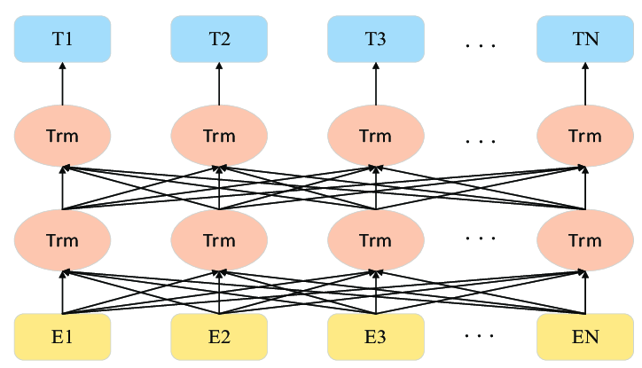

# Sentiment Analysis with ALBERT

This repository contains a Jupyter notebook for performing sentiment analysis on text data using the ALBERT (A Lite BERT) model. The project leverages natural language processing (NLP) techniques and deep learning to classify text as positive or negative. Additionally, a graphical user interface (GUI) built with `tkinter` allows users to input text and view sentiment predictions interactively.



## Table of Contents
- [Project Overview](#project-overview)
- [Features](#features)
- [Requirements](#requirements)
- [Installation](#installation)
- [Usage](#usage)
- [Dataset](#dataset)
- [Model Details](#model-details)
- [Results](#results)
- [Download](#download)
- [License](#license)

## Project Overview
The project performs sentiment analysis on the IMDB movie review dataset using the ALBERT model from the Hugging Face Transformers library. It includes data preprocessing, model training, cross-validation, and a GUI for real-time sentiment analysis. The notebook also generates visualizations to analyze the dataset and model performance.

## Features
- **Data Preprocessing**: Tokenization, stopword removal, and lemmatization using NLTK.
- **Model Training**: Fine-tuning the ALBERT model for binary sentiment classification (positive/negative).
- **Cross-Validation**: 5-fold stratified cross-validation to evaluate model performance.
- **Visualizations**: Plots for label distribution, training loss, validation loss, and accuracy.
- **GUI**: A `tkinter`-based interface for inputting text and viewing sentiment predictions.

## Requirements
To run the project, you need the following dependencies:
- Python 3.9+
- Jupyter Notebook
- Libraries:
  - `pandas`
  - `nltk`
  - `torch`
  - `transformers`
  - `scikit-learn`
  - `matplotlib`
  - `tkinter`
  - `evaluate`

## Installation
1. Clone the repository:
   ```bash
   git clone https://github.com/your-username/Sentiment-Analysis-with-ALBERT.git
   cd Sentiment-Analysis-with-ALBERT
   ```

2. Install the required dependencies:
   ```bash
   pip install -r requirements.txt
   ```

3. Download NLTK data:
   ```python
   import nltk
   nltk.download('punkt')
   nltk.download('stopwords')
   nltk.download('wordnet')
   ```

4. Ensure you have the IMDB Dataset (`IMDB Dataset.csv`) in the project directory. You can download it from [Kaggle](https://www.kaggle.com/datasets/lakshmi25npathi/imdb-dataset-of-50k-movie-reviews).

## Usage
1. Open the Jupyter notebook:
   ```bash
   jupyter notebook Sentiment_Analysis_with_ALBERT.ipynb
   ```

2. Run the cells sequentially to:
   - Preprocess the dataset.
   - Train the ALBERT model.
   - Perform cross-validation.
   - Generate visualizations.
   - Launch the GUI for sentiment analysis.

3. To use the GUI:
   - Run the final cell to open the `tkinter` window.
   - Enter text in the input box and click "Analyze Sentiment" to view the prediction.

## Dataset
The project uses the [IMDB Dataset](https://www.kaggle.com/datasets/lakshmi25npathi/imdb-dataset-of-50k-movie-reviews), which contains 50,000 movie reviews labeled as positive or negative. The dataset is preprocessed to remove stopwords, lemmatize words, and tokenize text for model input.

## Model Details
- **Model**: ALBERT (A Lite BERT) `albert-base-v2` from Hugging Face.
- **Tokenizer**: ALBERT tokenizer with a maximum sequence length of 128.
- **Training**: 2 epochs, batch size of 8, mixed precision training (if CUDA is available).
- **Evaluation Metrics**: Accuracy, precision, recall, and F1 score via 5-fold cross-validation.

## Results
Cross-validation results:
- **Validation Loss**: 0.3797
- **Validation Accuracy**: 0.8774
- **Validation Precision**: 0.8787
- **Validation Recall**: 0.8855
- **Validation F1 Score**: 0.8803

Example sentiment prediction:
- Input: "amr is watch good movie"
- Output: Positive

## Download
The project files, including the Jupyter notebook and sample GUI screenshot, can be downloaded from the GitHub repository:
[Download Sentiment-Analysis-with-ALBERT](https://github.com/your-username/Sentiment-Analysis-with-ALBERT/archive/refs/heads/main.zip)

## License
This project is licensed under the MIT License. See the [LICENSE](LICENSE) file for details.
